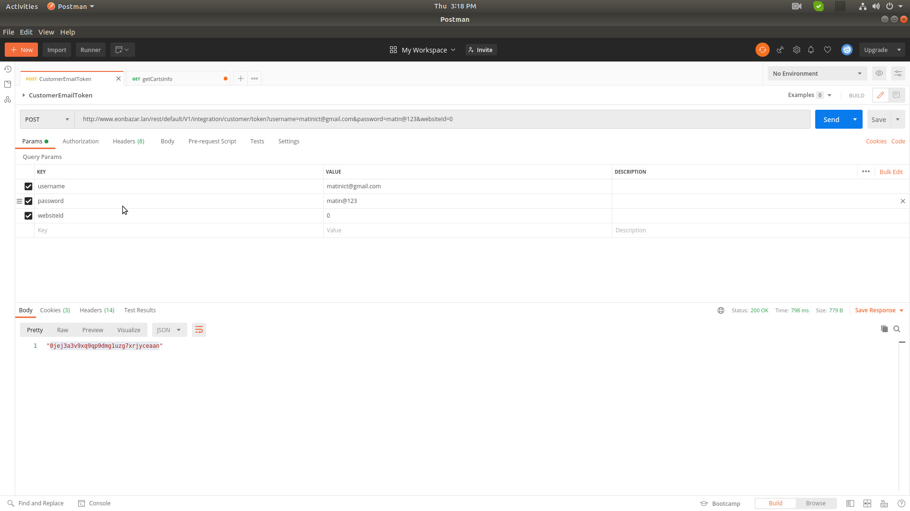
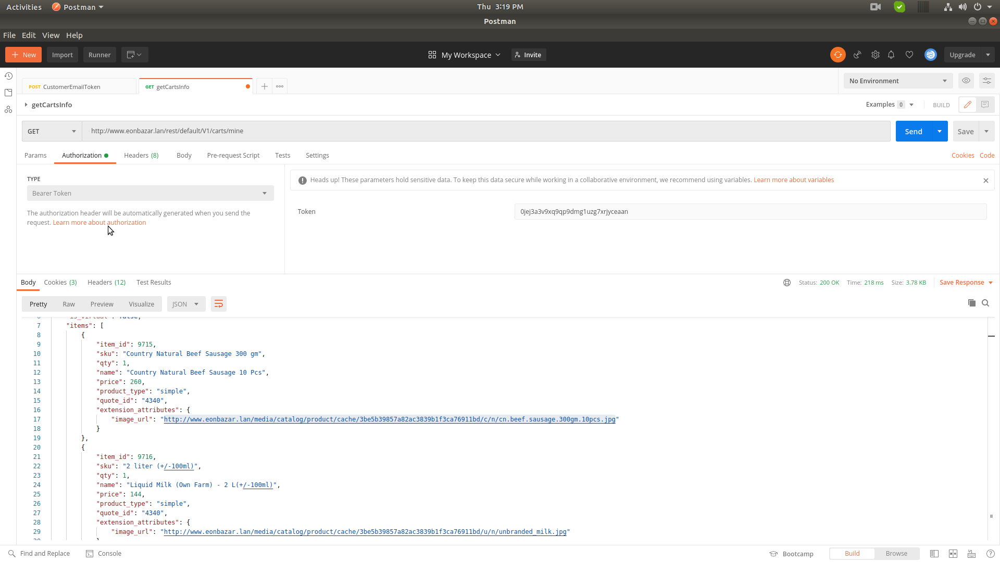

## Magento 2 EonInfosys_Quote

Magento_Quote Core Module no Product image Api end-Point , this module added product img url Cart api end point

Methods: Post
Url: http://www.eonbazar.lan/rest/default/V1/carts/mine

Video: https://youtu.be/zJul-_Qya7s
